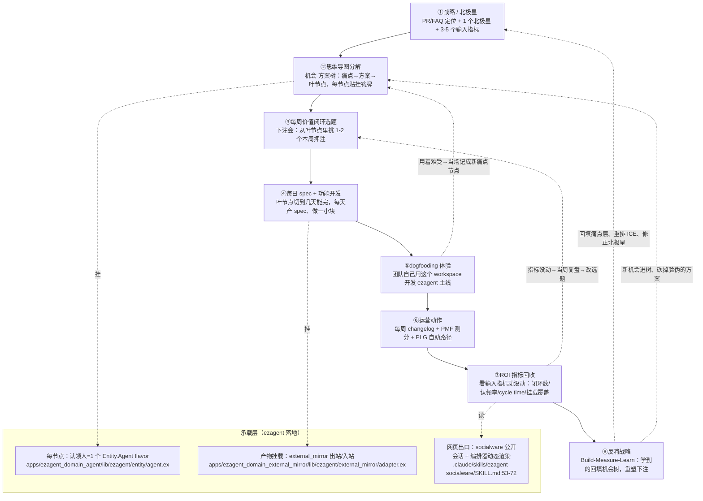

# 02 · 战略 → 产品 → 开发 → 运营 → ROI 再循环（完整流程 + 成功案例）

> 这是把【03-思维导图.md】那张静态大图变成一台**会转的发动机**：战略定方向 → 思维导图把方向拆成节点 → 每周选一两个节点开工 → 每天产 spec、做小功能点 → 自己用自己（dogfooding）体验 → 配套运营动作 → 收 ROI 指标 → 把学到的回填战略，再转下一圈。
>
> 全程大白话。引 ezagent 代码/文档带 file 路径（相对 worktree 根 `/home/yaosh/projects/ezagent-biz/.claude/worktrees/ezagent-yao/`）；引外部工具/方法论/案例带可核查链接。
>
> 配套阅读：方法论与案例的完整论证在 `docs/discuss/df-prd/research/C-方法论与成功案例.md`；节点骨架在 `docs/discuss/df-prd/03-思维导图.md`。本文不重复论证，只把它们**串成一条闭环并配周历**。

---

## 〇、定位先收口：这是内部 dogfooding 工具，不是对外产品（一票否决前先看这条）

把这条钉死，后面整套闭环才不失真：**本 workspace 当前定位是"我们自己用的内部 dogfooding 工具 + 一次 ezagent 能力的技术验证"，唯一已知用户=开发 ezagent 主线的我们这一个团队，不对外卖。**

为什么必须先二选一收口（俞军：用户=特定情境下的需求集合，混情境=核算必失真）：
- **情境 A（内部自用）**：我们一边开发 ezagent 主线、一边用这个 workspace 管自己。旧体验=飞书+GitHub+群+脑子，**旧体验低、净值可能为正**。
- **情境 B（对外卖给别的团队）**：别的团队已经重度沉淀在 Linear/Notion/飞书项目里，旧体验是打磨多年、体验极好的成熟工具，替换成本（认知+迁移+运维+信任）极高，**对外这笔交易用户价值净值大概率为负**。

本文及全套 df-prd **只按情境 A 写**。凡涉及情境 B 的动作——PMF 测分、PLG 自助路径、对外叙事、差异化 vs Linear——**本版一律降级为"暂不做，留待情境 A 验证成立后再议"**，下文周历和环节表已据此改写（原 PMF/PLG 环节标注为"对外，MVP 不做"）。坚持要做对外产品时，必须另补 ICP 收窄 + 迁移路径 + 定价三件，不在本版范围。

**这条改了什么口径**：北极星不再是"自己给自己数闭环数"（活动指标伪装结果指标），而是换成有外部检验的真结果指标——见 §〇之二。

## 〇之二、ROI 这笔账先真算一次（"有利润"的间接逻辑，别只喊口号）

定位为内部工具时，"有利润"= **省下来的对齐成本 > 自研+维护成本**。这笔账此前反复被当口号、从没真算，本版先给口径（数字开工后填实）：

```
回本周期 = 自研投入 ÷ 每周净省

自研投入 = 9.5 周排期 × 团队人天折钱（含机会成本：这 9.5 周没做 ezagent 主线的什么）
每周净省 = 每周省下的对齐时长 × 团队时薪 − 每周维护成本（跑 BEAM 服务节点 / SPA build / 双向同步）
```

**机会成本必须显式写出来**（C 类不能省的一刀）：做这个 workspace 的 9.5 周，放弃的是 ezagent 主线的什么？为什么 dogfooding 工具的边际收益 > 直接做主线功能？——这个问题不回答，"投这里不投主线"就没被论证。承载层贯穿表已把"ezagent 主产线"列为隐藏关键相关方。

---

## 一、端到端闭环流程图（mermaid）

这张图从"北极星"出发，顺时针转一圈回到"反哺战略"。每个方框是一个环节，箭头是交接物（上一环交给下一环什么）。



读图要点：
- **实线 = 正向推进**（一圈下来从战略走到指标回收）。
- **虚线 = 回环反馈**（⑧回填①②、⑦回⑦的选题、⑤把体验痛点当场变成新节点）——这是"再循环"的本质，不是走完一圈就结束。
- **下方 subgraph = 三件落地承载**：节点谁负责（agent）、产物怎么归位（external_mirror）、状态怎么对外（socialware）。它们不是流程环节，是托住整个流程的底座。

---

## 二、每个环节：谁做 / 产出什么 / 用什么工具 / 验收·指标

> 一行一个环节，对齐上面的①~⑧。"出处"列把环节锚到方法论或 ezagent 文件。

| # | 环节 | 谁做 | 产出什么 | 用什么工具 | 验收 / 指标 | 出处 |
|---|---|---|---|---|---|---|
| ① | 战略 / 北极星 | 产品负责人 | 一份 PR/FAQ（假新闻稿+5 页 FAQ）；定 1 个北极星 + 3-5 个输入指标 | 飞书 docx（PR/FAQ）+ 飞书 bitable（指标定义） | PR/FAQ 评审过一轮；北极星能用人话讲清、是领先指标不是虚荣指标 | Amazon 工作回溯 https://workingbackwards.com/concepts/working-backwards-pr-faq-process/ ；北极星 https://amplitude.com/books/north-star/about-north-star-framework |
| ② | 思维导图分解 | 产品（定结构）+ 各岗位（认领自己那层） | 机会-方案树：痛点→方案→叶节点，每个叶节点贴"挂钩牌"（挂哪个痛点/拨哪个输入指标/ICE 分/验证假设/闭环判据） | xmind 初稿 → markmap Markdown 真相源；挂钩牌落飞书 bitable | 树连通无孤儿（每节点能往上追到痛点）；每个叶节点挂钩牌填齐 | 机会-方案树 https://www.producttalk.org/opportunity-solution-trees/ ；ICE/RICE https://www.productlift.dev/blog/rice-vs-ice/ ；`03-思维导图.md:35`、`:210` |
| ③ | 每周价值闭环选题 | 产品负责人主持，全队下注 | 本周押注清单（1-2 个叶节点），按 ICE 分排序后挑 | 飞书 docx 下注会纪要 + markmap 标记本周节点 | 选的是"押注"不是"无限 backlog"；每个押注有明确闭环判据 | Shape Up 下注会 https://basecamp.com/shapeup/2.3-chapter-09 |
| ④ | 每日 spec + 功能开发 | 当天认领该叶节点的岗位（多为研发） | 一份一页 spec（pitch）+ 当天做完的一小块（issue/PR）；产物挂回节点 | 飞书/obsidian（spec）+ GitHub（issue/PR）+ 挂回 markmap 节点 | 每个工作日至少一个叶节点出 spec 或闭一小步；spec 过一道评审才算"出"（质量门，别注水） | Linear cycle https://linear.app/method/introduction ；Stripe shaping/质量门 https://www.bringthedonuts.com/essays/building-products-at-stripe/ ；`03-思维导图.md:217`、`:232` |
| ⑤ | dogfooding 体验 | 全队 | 自己用这个 workspace 来开发 ezagent 主线时记录的真实痛点；用着难受的当场变成新节点 | workspace 自身（网页出口）+ 飞书 bitable（痛点登记） | 每周至少 1 条来自自用的真实痛点进树；不是"想象的需求" | Notion/Figma 极致 dogfooding https://colossus.com/article/inside-notion/ 、https://openai.com/index/figma-david-kossnick/ |
| ⑥ | 运营动作（内部版） | 运营（+产品） | 每周 changelog（哪怕小也发，对内发给自己团队即可）。**PMF 测分 / PLG 自助路径属情境 B（对外），MVP 不做**——见 §〇收口 | 飞书 docx（changelog，经 external_mirror 镜到飞书群） | 每周 changelog 有≥1 条**自己团队可感知**的价值闭环 | Linear changelog https://lastrelease.io/blog/how-linear-uses-a-public-changelog （PMF/PLG 链接留待对外阶段） |
| ⑦ | ROI 指标回收 | 产品（数）+ 研发（自动汇总） | 本周指标快照：**北极星（改成有外部检验的结果指标，见下）** + 输入指标（认领率/cycle time/spec 产出率/对齐时长/挂载覆盖） | 闭环看板（数据从节点状态机自动汇总）+ 飞书 bitable 趋势 | 每个输入指标都有数、趋势可见；指标没动→当周复盘→改下周选题 | 北极星输入指标 https://amplitude.com/books/north-star/about-north-star-framework ；`03-思维导图.md:188-209` |

> **北极星口径修正（Item 9）**：内部自用场景下"周闭环数"是**活动指标伪装成结果指标**（自己给自己数闭环，没有外部检验）。本版把北极星改成两个有外部检验的真结果指标：**①对齐时长实测下降多少（核心赌注的价值兑现，05 阶段 1 硬验收）；②是否出现第一个愿意用的非自己团队（哪怕一次访谈级意向）**。"周闭环数"降级为输入指标之一，不再当北极星。
| ⑧ | 反哺战略 | 产品负责人 | 把学到的回填机会树：新机会进树、验伪的方案砍掉、ICE 重排、必要时修北极星 | xmind/markmap 重塑版 + 飞书下注会纪要 | 每 4-6 周期末有有意义成品、北极星动向已复盘、树已回填 | Lean Build-Measure-Learn https://theleanstartup.com/principles ；Shape Up 断路器 https://basecamp.com/shapeup/2.3-chapter-09 |

**承载层（贯穿①~⑧，不是单独环节）**：

| 承载 | 谁做 | 产出 | ezagent 机制（带 file 路径） | 验收 |
|---|---|---|---|---|
| 每节点一个认领人 = 一个 agent | 研发 | 每人 spawn 一个自己 flavor 的 `Entity.Agent`，追踪本人认领节点、能跨 agent 对话 | `apps/ezagent_domain_agent/lib/ezagent/entity/agent.ex`（base_behaviors `:86`）；现成 cc/curl/codex flavor，加口味抄 `apps/ezagent_core/lib/ezagent/plugin.ex:186-234`；跨 Kind 唯一通路 `Ezagent.Invocation.dispatch/1`（P14，不许 PubSub.broadcast 到入站 topic） | agent 能答"我认领的节点进度如何" + 能和别人对话（实测 `docs/discuss/intro/04-如何使用ezagent.md`） |
| 产物挂载到节点 | 研发 | spec/issue/PR/图的引用挂回节点，出到飞书/GitHub | external_mirror 出站抄 feishu adapter `apps/ezagent_domain_external_mirror/lib/ezagent/external_mirror/adapter.ex`；入站走 `Ezagent.Invocation.dispatch/1`（仿 `inbound_dispatcher.ex:58`） | 在外部工具产出后，节点页能点开看到该产物 |
| 网页对齐出口 | 研发+产品 | 一个 socialware 公开会话当团队状态出口，编排器 agent 动态渲染整棵树+指标 | `public_view: true` SessionTemplate（`session_template.ex:719`，fail-closed `public_view.ex:38`）；编排器动态生成界面 `.claude/skills/ezagent-socialware/SKILL.md:53-72`；写入点 `Surface.put_version(turn_id, tree)`+`approve` | 会话在服务节点内活着、SPA 已 build（`pnpm install`+`mix assets.build`），匿名访客打开 `/socialware/chat?session_uri=…` 能看到聚合状态 |

**落地三坑（来自 socialware SKILL，开工前贴墙上）**：① `public_view?/1` 读活会话 slice，会话必须和服务在同一个 BEAM，否则匿名访客被 302 弹去 `/login`（`SKILL.md:126-138`）；② `public_view` 只认字面布尔 `true`，`"true"`/缺失都按私有（`SKILL.md:66-90`）；③ 客户 SPA 没 build 会 200 白屏（`SKILL.md:143-147`）；④ 编排器重、要 cc 凭证、可能超时，但会话仍持久化——断言断在会话别断编排器（`SKILL.md:110-117`）。

---

## 三、dogfooding 节奏：具体周历（周一到周日 + 每日固定动作）

> 三层时间盒套在一起：**每 4-6 周一个押注周期**（外圈）/ **每周一闭环**（中圈）/ **每天一小块**（内圈）。下面是一个标准周（中圈）的周一到周日，再叠一层"每天都做的固定动作"。

> **仪式最小集收口（Item 7，避免系统2 负担过重 + 文档内部打架）**：6 个每周仪式对 3-10 人团队是过重的认知负担，且与本套材料"砍仪式"建议自相矛盾。**MVP 第一圈只强制两个仪式：日 spec（内圈）+ 周 changelog（周五）**。下面 3.2 周历里的下注会、探索访谈、PMF 测分、指标复盘等其余 5 个，**第一圈一律标为"可选/后置"**，等"对齐时长下降"核心赌注被实测验证（05 阶段 1）后，再按团队规模逐个加回。3 人精简循环和 7-10 人完整循环承受力不同，加回节奏分档（见 04 团队画像分档）。

### 3.1 每天都做的固定动作（内圈，雷打不动）

| 时段 | 动作 | 谁 | 落点 |
|---|---|---|---|
| 早 15 分钟 | 各自 agent 自动汇报"我认领节点昨天进度/今天计划"，人看一眼对齐 | 全员 + 各自 agent | 网页出口（socialware 会话刷新） |
| 上午 | 当天叶节点先产 spec（一页 pitch），过质量门（一道评审）才算"出" | 当天认领岗位 + 评审人 | 飞书/obsidian spec → 挂回 markmap 节点 |
| 全天 | 围绕该叶节点做一小块（issue 切到几天能完），feature-flag 推内部试用 | 研发 | GitHub issue/PR → 挂回节点 |
| 晚 | 产物挂载检查：今天产出的东西都挂回节点了吗（挂载覆盖率别掉） | 当天认领岗位 | external_mirror 出站 → 节点页 |

每日验收信号：**当天至少一个叶节点 spec 出了或闭了一小步，且产物已挂回节点。**

### 3.2 一周周历（中圈，周一到周日）

| 周几 | 主题 | 谁主导 | 干什么 | 产出 | 验收/指标 | MVP 第一圈 |
|---|---|---|---|---|---|---|
| **每日** | 日 spec（内圈，**最小集**） | 当天认领岗位 | 当天叶节点产一页 spec、过一道质量门、做一小块、产物挂回节点 | spec + GitHub PR + 挂回 markmap 节点 | 当天≥1 个叶节点 spec 出或闭一小步、产物已挂回 | **强制** |
| **周一** | 下注 + 选题（环节③） | 产品负责人 | 开 30 分钟下注会，从叶节点里按 ICE 分挑本周 1-2 个押注，标进 markmap | 飞书下注会纪要 + 本周押注节点标记 | 本周押注清单确定、每个有闭环判据 | 可选/后置 |
| **周二** | 探索访谈（喂养环节②） | 全队轮值 | 跟 1 个客户/dogfood 用户聊，收真实痛点（不是收方案），新机会进树 | 飞书 bitable 访谈纪要 + 机会树新增节点 | 每周≥1 轮访谈、至少 1 条新痛点入树 | 可选/后置 |
| **周三** | 开发深水区（环节④） | 研发 | 押注节点的核心一小块落地，daily 节奏不变 | GitHub PR + spec | 押注进度过半 | 并入日 spec |
| **周四** | dogfooding 集中体验（环节⑤） | 全队 | 集中用 workspace 做主线活，把"用着难受"当场记成新节点 | 飞书 bitable 自用痛点登记 | ≥1 条自用痛点进树 | 可选/后置 |
| **周五** | 收闭环 + 发 changelog（环节⑥，**最小集**） | 运营 + 产品 | 把本周对自己团队可感知的价值写成 changelog（哪怕小也发），经 external_mirror 镜到飞书群 | 飞书 changelog（已镜飞书群） | 本周 changelog 有 1-2 条团队可感知闭环 | **强制** |
| **周六** | PMF 测分 + 运营调整（环节⑥） | 运营 + 产品 | **（情境 B 对外动作，MVP 不做）** 原为测 PMF 分定运营方向 | — | — | 不做（对外） |
| **周日** | 指标回收 + 复盘（环节⑦） | 产品 | 看看板：北极星（对齐时长降幅 + 是否有非自己团队意向）+ 输入指标动没动；指标没动→定位卡点→修正下周选题 | 闭环看板快照 + 飞书复盘短记 | 全部输入指标有数、趋势可见、下周选题已调 | 可选/后置 |

### 3.3 外圈：每 4-6 周一次押注周期收口（环节⑧）

- **断路器**：押注的时间盒到了没做完，**默认不延期**，项目回炉重塑（Shape Up 纪律 https://basecamp.com/shapeup/2.3-chapter-09 ）。
- **回看北极星**：这 4-6 周北极星动没动？输入指标和北极星的因果假设对不对？
- **重塑机会树**：验伪的方案砍掉、新机会补进、ICE 重排，必要时连北极星定义一起修——这就是把环节⑦的发现回填到①②，闭环合拢，转下一圈。
- 产出：xmind/markmap 重塑版 + 飞书下注会纪要；验收：期末有有意义成品、树已回填。

---

## 四、竞品分析（不是"案例背书"——这 6 家是直接竞品，逐条看"它已做到什么程度 / 我们凭什么不同"）

> **参照系修正（Item 5）**：下面 6 家公司**既是方法来源、也是直接竞品**——Linear 的 cycle+changelog+triage、Notion 的 dogfooding 中枢、Figma 的人人认领，都是它们产品里**已经规模化交付的能力**，不是"无人做过的方法"。此前把它们当"给自己背书的前辈"是偷换参照系；本版换回竞争参照系，每条加一栏诚实交代"它已做到什么程度、我们凭什么不同、用户为什么要从它迁过来（情境 B）/我们为什么只先内部自用（情境 A）"。
>
> **一句话总结论**：作为内部 dogfooding 工具，我们的优势是"长在 ezagent 自己的运行时上、能 dogfood 主线能力"，不靠打赢它们；作为对外产品，这些竞品体验远好于一个要自己跑 BEAM 的自研工具，**情境 B 暂不正面竞争**（见 §〇收口）。

### 案例 1 · Linear —— 佐证"每天一小块 / 每周 changelog 当闭环钟摆"（环节④⑥、周五）
- **怎么干的**：Roadmap → Projects → 2 周 Cycles → Issues，issue 切到几天能完；客户 bug/需求进 Triage 收件箱，每周轮值 goalie 分流；**用 Linear 开发 Linear**（自己吃狗粮）；**每周发 changelog 哪怕很小也发**，逼着持续 ship + 形成文化动量。
- **我们借鉴哪条设计**：每日一小块（3.1）、周五发 changelog 当闭环判据（3.2）、各自 agent 像 goalie 一样盯自己的节点（承载层）。
- **它已做到 / 我们凭什么不同**：cycle+changelog+triage 已是 Linear 规模化交付的成熟能力、体验极好且已有 AI。我们不在这条上正面赢它；唯一差异化是"goalie 由每人一个长期 agent 自动当"，但这恰是最高不确定性赌注（05 阶段 1 才验）。**情境 B 用户没有迁移理由，故只先内部自用。**
- 链接：https://linear.app/method/introduction ；https://www.lennysnewsletter.com/p/how-linear-builds-product ；https://lastrelease.io/blog/how-linear-uses-a-public-changelog

### 案例 2 · Superhuman —— 佐证"每周 PMF 测分当运营方向盘 / 指标驱动优先级"（环节⑥⑦、周六）
- **怎么干的**：四问卷 → 按"最高期待客户"分群 → 分析爱与抗拒原因 → 路线图一半加固铁粉爱的点、一半消除墙头草顾虑 → **每周测 PMF 分**，一年把分从 22% 拉到 58%；PMF 分**直接决定**路线图分配。
- **我们借鉴哪条设计**：指标没动就改选题（⑦回⑦虚线）。**注意：周六 PMF 测分本身属情境 B 对外动作，MVP 不做（见 §〇）**——这里只借"用指标驱动优先级"的思路。
- **它已做到 / 我们凭什么不同**：Superhuman 的 PMF 引擎是面向真实外部付费用户的。我们当前无外部用户、无付费，套 PMF 周分是"自己给自己测"，没有外部检验意义；所以本版把它降级，北极星改成"对齐时长下降 + 第一个非自己团队意向"。
- 链接：https://review.firstround.com/how-superhuman-built-an-engine-to-find-product-market-fit/ ；https://coda.io/@rahulvohra/superhuman-product-market-fit-engine

### 案例 3 · Notion —— 佐证"自己天天住在产品里 / 文档+数据库当中枢"（环节⑤、承载层）
- **怎么干的**：知识库、项目计划、会议纪要、backlog、bug、用户反馈**全在 Notion 里**；员工泡在 Notion Dev 测试环境实时试半成品功能；原型→dogfood→反馈的循环是日常驱动力。
- **我们借鉴哪条设计**：周四集中 dogfooding、用着难受当场变新节点（3.2、⑤回②虚线）；飞书/obsidian+数据库+思维导图当中枢（承载层）。
- **它已做到 / 我们凭什么不同**：Notion 的 dogfooding 中枢已是成熟商业产品、体验远好于一个要自己跑 BEAM+SPA build 的自研工具。我们不在"中枢体验"上赢它；情境 A 的便利（自己用着顺）≠ 情境 B 用户愿意付替换成本迁过来，这点 §〇已点破。
- 链接：https://colossus.com/article/inside-notion/ ；https://ones.com/blog/knowledge/how-notion-uses-notion-revolutionize-workflow/

### 案例 4 · Figma —— 佐证"人人可认领、人人挂产物，降低参与门槛"（环节②承载层、思维导图认领机制）
- **怎么干的**：设计系统集中化让一致性默认发生；办 **Maker Week**（全员黑客周，不只产品团队）和全员竞赛，把"动手试新东西"门槛压到最低，非技术岗也敢上手。
- **我们借鉴哪条设计**：思维导图每个节点"人人可认领、人人挂产物"、非核心岗也产出（承载层 + 节点状态机）。
- **它已做到 / 我们凭什么不同**：Figma 的"低门槛人人参与"靠的是极致打磨的交互（系统1 就能上手）。我们的认领=Grant/挂载=slice 是全新心智模型，认知负担更高（详见 04 团队画像 + 仪式最小集收口）；要慎防"要求启动系统2 的设计转化率天然低"。
- 链接：https://openai.com/index/figma-david-kossnick/ ；https://help.figma.com/hc/en-us/articles/14552802134807-Lesson-1-Welcome-to-design-systems

### 案例 5 · Stripe —— 佐证"每天产 spec 要过质量门，别注水"（环节④、周二/每日质量门）
- **怎么干的**：从用户倒推；用 shaping（在大战略和详细 PRD 之间先做粗方案填空）；开发团队花 exposure hours 跟开发者待一起看怎么集成；任何改 API 的变更必须过 API Review（跨职能强制评审，常传阅 20 页设计文档）。
- **佐证我们哪条设计**：每日 spec 过一道评审才算"出"（3.1 质量门 / 环节④验收）、shaping≈给叶节点写 pitch。
- 链接：https://www.bringthedonuts.com/essays/building-products-at-stripe/ ；https://blog.postman.com/how-stripe-builds-apis/

### 案例 6 · Basecamp（Shape Up）—— 佐证"每周下注 + 4-6 周押注 + 断路器"（环节③⑧、周一/外圈）
- **怎么干的**：塑形写 pitch → 下注会挑押注（"Bets, not Backlogs"）→ 6 周周期做 → 2 周冷却 → 断路器（到点没做完默认不延期，回炉重塑）。
- **佐证我们哪条设计**：周一下注会选题（3.2）、外圈 4-6 周押注周期 + 断路器收口（3.3）。
- 链接：https://basecamp.com/shapeup ；下注会 https://basecamp.com/shapeup/2.3-chapter-09 ；Bets not Backlogs https://basecamp.com/shapeup/2.1-chapter-07

> 战略层背书（不单列）：**Amazon** 的 PR/FAQ 给"思维导图根节点=一份新闻稿"提供权威范式（https://workingbackwards.com/concepts/working-backwards-pr-faq-process/ ）；**Amplitude** 北极星框架给"功能点拨动输入指标"提供口径（https://amplitude.com/books/north-star/about-north-star-framework ）；**Teresa Torres** 机会-方案树给"思维导图中段主干"提供结构（https://www.producttalk.org/opportunity-solution-trees/ ）；**Intercom/Dropbox** 分别是 RICE/ICE 的真实出处（https://www.productlift.dev/blog/rice-vs-ice/ ）。

---

## 五、一句话把闭环串起来

（**MVP 第一圈的最小闭环**）战略用 PR/FAQ 说清给"我们自己"解决什么、定北极星=对齐时长降幅 → 思维导图（机会-方案树）把它拆成有挂钩牌的叶节点 → 每天产 spec、做一小块、产物挂回节点（日 spec 是强制最小集）→ 全队自己用这个 workspace 开发 ezagent 主线、把难受当场变新节点 → 每周发一次对内 changelog（强制最小集）→ 周日收指标看对齐时长降没降 → 每 4-6 周回看北极星、重塑机会树回填战略，转下一圈。下注会/访谈/PMF/复盘等其余仪式第一圈后置，待核心赌注（对齐时长下降）经 05 阶段 1 实测验证再加回。承载这一切的是 ezagent 三件套：每人一个 agent 盯节点、external_mirror 把产物挂回节点、socialware 一个网页出口让全队对齐。**全程定位=内部 dogfooding 工具，不对外卖（§〇）。**
