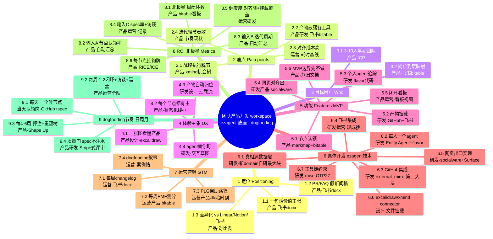

# 03 · 产品第一张思维导图（团队产品开发 workspace）

> 这是产品的【第一张思维导图】，把"定位 → 痛点 → 用户 → 体验 → 功能 → 具体开发(挂 ezagent 技术) → 运营/营销 → ROI/北极星 → dogfooding 节奏"串成一条逻辑链，每个叶子尽量给：节点名 / 认领岗位 / 在哪个工具产出什么产物 / 验收信号。
>
> 三份打底研究：`docs/discuss/df-prd/research/A-ezagent能力盘点.md`（ezagent 能落什么）、`B-工具选型调研.md`（每个工具能不能被 agent 读写、产物能不能挂回节点）、`C-方法论与成功案例.md`（战略→开发→运营怎么串、6 个真实公司样板）、`D-产品框定.md`（把这个 workspace 当产品框定）。
>
> 全程大白话。引 ezagent 代码带 file 路径（相对 worktree 根 `/home/yaosh/projects/ezagent-biz/.claude/worktrees/ezagent-yao/`）；引外部工具/方法论带可核查链接。
>
> **怎么读**：每个分支都回答四问——① 它服务上游哪个目标？② 产出什么？③ 谁认领？④ 挂什么工具产物？主干层层下钻，越往下越具体（叶子可直接开工）。

---

## 〇、用户价值公式（读功能前先读这一节）

> 评审（俞军方法论）指出本套材料最弱的一环是**用户价值核算**：只算了开发成本，几乎没算用户支付的代价。本节把**用户价值公式**钉死，下面每个功能/关键节点都要按它回答三问，否则不算想清楚。

**用户价值 = 新体验 − 旧体验 − 替换成本**。每个功能/节点旁挂一张**价值卡**，强制回答：

- **给谁**：哪一类用户、在哪个情境下（情境 A=我们自己 dogfood 内用 / 情境 B=对外卖给别的团队，二者旧体验天差地别，**必须分开算**）。
- **创造了什么真实价值**（新体验）：不是"做了个功能"，而是"用户原来要花 X、现在只花 Y"的真实差额（对齐时长↓、找东西↓、漏接↓）。
- **替换成本**（最易低估，往死里挖）：用户为用上它要付的**非货币代价**——学习成本（新心智模型）+ 迁移成本（已在 Linear/Notion/飞书的数据和肌肉记忆）+ 运维成本（自己跑 BEAM/SPA build/双向同步）+ 信任成本（agent 答不准比没有更坏）。

**判定线**：套损失厌恶 2.5×——用户换回的价值要 > 替换成本的 2.5 倍，交易才成立。

**情境收口（评审整改 1）**：本图当前**先锚定情境 A（纯内部 dogfooding 工具）**，对一个真实用户（我们自己）做实"旧体验≈0、净值明显为正"。情境 B（对外卖）的动作（差异化 vs Linear、PMF 测分、PLG 自助、对外叙事）**降级为"待情境 A 验证后再启"**，不作为 MVP 承诺——因为对在用 Linear/Notion 的成熟团队，替换成本（认知+迁移+运维+信任）极高，净值大概率为负，先做对外是一头扎进旧体验最高的红海。

---

## 一、缩进列表版思维导图（层级权威）

- **【根】团队产品开发 workspace**（一张活的产品大图：定位→运营全程串联，节点有人认领、产物自动挂回、每人一个 agent 盯、一个网页出口对齐；底座 = ezagent `docs/discuss/intro/00-总览.md:8`）
  - 自身定位：dogfooding 工具 —— 它既是产品，又是开发 ezagent 主产线时自己用的工具（`D-产品框定.md:13`）

  - **1 · 定位（Positioning）** —— 服务上游：根。回答"给谁解决什么、上线那天怎么说"，是整张图"有的放矢"的源头（方法论：Amazon 工作回溯 PR/FAQ https://workingbackwards.com/concepts/working-backwards-pr-faq-process/ ）
    - 1.1 一句话价值主张
      - 节点名：把"想清楚→做出来→卖出去"整条逻辑链收进一张活的思维导图（`D-产品框定.md:26`）
      - 认领：产品负责人
      - 产物：飞书 docx 一页定位稿（飞书云文档，团队实时协作 `B-工具选型调研.md:114`）
      - 验收：全队能用一句话复述价值主张，无歧义
    - 1.2 PR/FAQ 假新闻稿（根节点的"为什么做"）
      - 节点名：假装产品已上线，对客户宣布它 + 5 页内 FAQ
      - 认领：产品负责人
      - 产物：飞书 docx 一份 PR/FAQ（模板 https://workingbackwards.com/resources/working-backwards-pr-faq/ ）
      - 验收：PR/FAQ 定稿、团队评审过一轮
    - 1.3 差异化定位（vs Linear / Notion / 飞书项目）—— **情境 B 动作，MVP 降级**
      - 节点名：别人是"任务工具+AI 插件+手动贴链接"，我们是"思维导图当骨架+每人一个 agent 当神经+产物自动挂载当血肉"（`D-产品框定.md:47`）
      - **价值卡 + 评审警示**：给谁=情境 B 对外团队（**当前不锚定**）；评审（B 类竞品核验）指出 Linear/Notion 早有 AI、体验远好于自研工具，**这条差异化主张在真实竞品前被大幅削弱**——故 MVP 先不靠它立项。改写要点：把"竞品当案例引"改成"竞品分析"，老实写每条能力 Linear/Notion 已做到什么程度、我们凭什么不同（参照系从背书换回竞争）。
      - 认领：产品负责人
      - 产物：飞书 docx **竞品分析表**（不是背书表）（Linear https://linear.app/ ；Notion https://www.notion.so/ ；飞书项目 https://www.feishu.cn/product/project ）
      - 验收：表里我们这列每格能讲清"凭什么不一样"，且**每条都对照竞品已做到的程度**，不回避"用户为什么从已做到的工具迁过来"

  - **2 · 解决的痛点（Pain points）** —— 服务上游：定位。每个痛点都是后面功能存在的理由（方法论：Teresa Torres 机会-方案树，痛点挂根、方案挂痛点下 https://www.producttalk.org/opportunity-solution-trees/ ）
    - 2.1 战略和执行脱节
      - 节点名：定位/痛点在 PPT、开发只剩工单、运营另一套 KPI，三段各说各话（`D-产品框定.md:84`）
      - 认领：产品负责人
      - 产物：xmind 机会-方案树根节点（痛点层骨架；xmind 仅作初稿/兼容 `B-工具选型调研.md:34`）
      - 验收：每个开发节点都能往上追到它服务的痛点（树连通无孤儿）
    - 2.2 产物散落各工具
      - 节点名：图在 xmind、架构图在 excalidraw、代码在 GitHub、文档在飞书/obsidian、数据在库——找东西翻五个地方（`D-产品框定.md:87`）
      - 认领：产品负责人 + 研发
      - 产物：飞书 bitable 一张"工具→产物→在哪"现状盘点表（bitable 多维表 `B-工具选型调研.md:119`）
      - 验收：盘点表确认"节点是唯一索引"是真痛点（成员举手认领过这个痛）
    - 2.3 对齐成本高
      - 节点名：开会同步、刷群问"做到哪了"占大量时间、信息很快过期（`D-产品框定.md:90`）
      - 认领：运营 + 产品
      - 产物：飞书 docx 一份"当前每周对齐耗时"基线测量（给 ROI 的"对齐时长下降"打基准 `D-产品框定.md:167`）
      - 验收：有一个可量化的对齐耗时基线数字（小时/周）
    - 2.4 迭代慢、节奏散
      - 节点名：没有强制节奏，功能拖很久才闭环，运营策略几周不动（`D-产品框定.md:93`）
      - 认领：产品负责人
      - 产物：飞书 docx 当前迭代节奏现状（给"日 spec/周闭环"立靶）
      - 验收：团队认同需要一个强制节奏骨架

  - **3 · 目标用户 / 团队画像（Who）** —— 服务上游：定位 + 痛点。框定"谁最该用、谁认领哪层节点"（`D-产品框定.md` §2）
    - 3.1 团队画像：3–10 人早期产品团队（产研运设混编、无专职对齐、追求高频迭代、能接受 agent 进工作流；首批=我们自己 `D-产品框定.md:54-59`）
      - **拆两档画像（评审整改 6：3 人和 10 人对仪式承受力天差地别，不能当单一画像）**：
        - 画像 a「3–4 人精简循环」：一人多岗、角色无法轮值，**只承受最小仪式集（日 spec + 周 changelog）**，价值点在"少开会、少漏接"。
        - 画像 b「7–10 人完整循环」：角色可分工轮值，能承受更密仪式，价值点在"跨岗对齐 + 责任不悬空"。
      - **价值卡**：给谁=情境 A 我们自己（首批就这一档真实用户，旧体验=飞书+群+脑子一团乱，≈低）；真实价值=把"想清楚→做出来→卖出去"收进一张活图，对齐时长↓；替换成本=学一套节点状态机心智（情境 A 无历史数据迁移负担，这是它替换成本远低于情境 B 的关键）。
      - 认领：产品负责人
      - 产物：飞书 docx 团队画像 + ICP（理想客户）描述（**标清这是情境 A 画像；情境 B 的 ICP 待情境 A 验证后再收窄到"旧体验≈0 的新组队团队"**）
      - 验收：画像能筛掉明显不匹配的团队（边界清晰）；两档画像各自的仪式密度写清
    - 3.2 岗位 → 认领层映射（这条决定整张图谁认领什么 `D-产品框定.md:63`）
      - 产品 → 认领 定位/痛点/体验/功能 层；产出 xmind 导图 + 飞书/obsidian spec
      - 研发 → 认领 具体开发 层；产出 GitHub issue/PR + 数据库
      - 设计 → 认领 用户体验/框架补充 层；产出 excalidraw 框架图 + Figma 原型
      - 运营 → 认领 营销/运营 层；产出 飞书文档 + 数据看板
      - 认领：产品负责人定表、各岗位认领自己那行
      - 产物：飞书 bitable 一张"岗位↔层↔工具↔产物"映射表
      - 验收：每个第一层分支都至少有一个岗位认领（无悬空分支）

  - **4 · 用户体验主张（UX promises）** —— 服务上游：痛点。四条体验承诺，直接对治四个痛点（`D-产品框定.md:100`）
    - 4.1 一张图看懂一个产品（对治 2.1 脱节）
      - 认领：产品 + 设计
      - 产物：excalidraw workspace 主界面线框图（手绘白板，可 mermaid→excalidraw `B-工具选型调研.md:72`）
      - 验收：新人打开导图 5 分钟讲清产品逻辑链
    - 4.2 每个节点都有主（对治 2.3 对齐）
      - 节点名：节点必被认领，未认领是显式"待分配"状态，不会无声烂掉（呼应 ezagent"消息没人接收不能静默丢" `D-产品框定.md:103`）
      - 认领：产品
      - 产物：excalidraw 节点状态机线框（待分配→已认领→进行中→已闭环）
      - 验收：导图里不存在"既没认领也没标待分配"的灰色节点
    - 4.3 产物自动归位（对治 2.2 散落）
      - 认领：研发 + 设计
      - 产物：excalidraw "产物→节点"挂载流线框图
      - 验收：在任一外部工具产出后，节点页能点进去看到该产物
    - 4.4 有个 agent 替你盯（对治 2.3 对齐）
      - 认领：研发
      - 产物：excalidraw "个人 agent 追踪+跨 agent 对话"交互草图
      - 验收：能演示一个 agent 回答"我认领的节点进度如何"

  - **5 · 功能模块（Features，MVP 五块）** —— 服务上游：体验承诺。每块标"用 ezagent 哪块能力落地"（`D-产品框定.md` §5）
    - 5.1 节点认领（思维导图 + 责任绑定）→ 服务 4.1/4.2
      - 节点名：根+六层第一分支(定位/痛点/体验/功能/开发/运营)，节点可增删挂子节点；状态机 待分配→已认领→进行中→已闭环
      - **价值卡**：给谁=情境 A 全队（每个认领人）；真实价值=责任不再无声烂掉，"这事归谁/做到哪"一眼可查，省掉刷群问进度（新体验=旧要素重组，价值在"显式待分配"这一新约束）；替换成本=学一套状态机心智（中），情境 A 无迁移成本。**净值正**：替换成本低、价值真实。
      - 认领：产品
      - 产物：xmind 导图初稿 → markmap Markdown 真相源（节点=标题有锚点 id `B-工具选型调研.md:43`）；认领=飞书 bitable 一行
      - 验收：节点能认领、状态能流转、未认领显式标"待分配"
    - 5.2 产物挂载（各工具产出→挂回节点）→ 服务 4.3
      - 节点名：xmind/excalidraw/GitHub/飞书/库 产物挂到节点，带类型+来源+时间，一节点可挂多类
      - **价值卡**：给谁=情境 A 全队（找东西的人）；真实价值=节点变成唯一索引，"找东西翻五个地方"→点一个节点看全，真实节省查找时间；替换成本=运维成本（GitHub/飞书双向同步要自研、R7 飞书订阅 unverified——**这个价值当前是承诺式、未交付**，须以 GitHub+飞书两来源实跑兑现）。**净值待兑现**：价值真实但依赖自研同步落地。
      - 认领：研发
      - 产物：GitHub issue/PR URL + 飞书 docToken + excalidraw 文件路径，全部落 ezagent 库映射（真相源 SQLite `B-工具选型调研.md:147`）
      - 验收：MVP 跑通 GitHub + 飞书两个挂载来源（产物挂载覆盖率可统计）
    - 5.3 个人 agent 追踪（每人一个 agent + 互相对话）→ 服务 4.4
      - 节点名：每人一个长期 agent 追踪本人认领节点；agent 间会话对话、与人平等参会
      - **价值卡（唯一可能的真新体验，也是最高不确定性赌注）**：给谁=情境 A 全队；真实价值="问人"变"问 agent"，对齐时长直接降——**但这是核心赌注，价值未经实测**；替换成本=信任成本（agent 答不准比没有 agent 更坏，材料自承）。**净值未验证**：必须先实测"对齐时长真的降了"（见 6/05 阶段 1 硬验收），降了才往下，没降就停，别造完整套才发现赌注不成立。
      - 认领：研发
      - 产物：GitHub 上 agent flavor/behavior 代码 + 飞书 docx agent 行为说明
      - 验收：MVP 用 curl flavor 验证"能追踪 + 能对话"，cc flavor 按需上
    - 5.4 网页对齐出口（一页看全队状态）→ 服务 4.1/4.2
      - 节点名：一个网页展示整张图当前状态（认领、产物、进度、本周闭环数），含未注册旁观者可看
      - **价值卡**：给谁=情境 A 全队 + 负责人；真实价值=用一页替代"晨会同步+刷群问进度"，对齐时长↓（这是最直接可量的省时）；替换成本=运维成本（要自己跑 BEAM 服务节点活会话 + SPA build，三坑不踩才有页）。**净值正**（情境 A 内运维成本自担可接受）。
      - 认领：研发 + 产品
      - 产物：GitHub 上 socialware app 配置（带 public_view 的 SessionTemplate）+ excalidraw 出口页线框
      - 验收：打开 `/socialware/chat?session_uri=…` 能看到聚合状态（编排器吐页面树）
    - 5.5 闭环看板（dogfooding 节奏可视化）→ 服务 2.4 + 北极星
      - 节点名：把"日 spec/周价值闭环/周运营调整"做成看板，指标从节点状态自动汇总
      - **价值卡**：给谁=情境 A 产品/运营/负责人；真实价值=节奏可见、倒逼速度，不用手工统计进度；替换成本=低（建在 5.1/5.4 之上、纯汇总，无新心智）。**净值正但不阻塞**：价值在"让发动机转速可见"，是锦上添花不是地基。
      - 认领：产品 + 运营
      - 产物：网页出口的一个视图（数据从 5.1 状态机汇总），周报经 external_mirror 镜到飞书群
      - 验收：看板能显示"今日 spec 出没出、本周闭了几个环、运营调没调"
    - 5.6 MVP 边界（先不做，避免压在在建能力上）
      - 不做 world / agent-schema（上游在建未进 main，别当已有 `A-ezagent能力盘点.md` §6）
      - 不做精细分租户运营、不做复杂结算（settlement 电商才用）
      - 思维导图先 xmind 承载 + 关键结构镜进 workspace，不自研导图编辑器
      - 验收：MVP 范围文档评审过，无人试图"顺手"做在建能力

  - **6 · 具体开发（挂 ezagent 技术）** —— 服务上游：功能模块。把每个功能落到 ezagent 机制（A 篇三档：现成/要写/依赖在建）
    - 6.1 真相源数据层（节点↔认领↔产物映射）
      - 节点名：用 ezagent 自带 SQLite 存映射，外部工具数据是副本，真相源在 ezagent 库（`B-工具选型调研.md:147`）
      - ezagent 机制：新 domain/plugin 建"节点"领域模型；节点=Kind、认领=Grant、挂载=slice+附件（`A-ezagent能力盘点.md` §5，**最大块自研**）
      - 认领：研发（核心）
      - 产物：GitHub 上新 domain app 代码（Behavior + `{:set,key,value}` effect 写、`ctx[:read]` 读）
      - 验收：节点 CRUD + 认领 + 挂载一条产物，能从库查回；ezagent 无现成"图/节点"，这是第一块要自研（`A-ezagent能力盘点.md:296`）
    - 6.2 每人一个 agent（Entity.Agent + flavor）
      - 节点名：每人 spawn 一个 `entity://<ws>/agent/<人名>`，MVP 用 curl flavor 轻量验证（`A-ezagent能力盘点.md` §1）
      - ezagent 机制：`apps/ezagent_domain_agent/lib/ezagent/entity/agent.ex`（base_behaviors 在 `:86`）；现成 cc/curl/codex flavor，加新口味抄 plugin（`apps/ezagent_core/lib/ezagent/plugin.ex:186-234`）
      - 认领：研发
      - 产物：GitHub 上 flavor 配置/新 behavior 代码
      - 验收：每人 agent 能读"自己认领节点"+ 答别人问（实测路径 `docs/discuss/intro/04-如何使用ezagent.md`）
    - 6.3 GitHub 集成（issue+PR 双向同步）—— 第二大自研工程
      - 节点名：出站 adapter 把节点状态推成 issue/评论；入站 webhook 把 PR/issue 事件接回挂节点（`A-ezagent能力盘点.md:170`）
      - ezagent 机制：external_mirror 出站 adapter（`apps/ezagent_domain_external_mirror/lib/ezagent/external_mirror/adapter.ex` 抄 feishu）；入站走 `Ezagent.Invocation.dispatch/1`（P14 铁律，仿 `inbound_dispatcher.ex:58`）；Projects v2 必须 GraphQL（`B-工具选型调研.md:96`）
      - 认领：研发
      - 产物：GitHub 上新 plugin 代码（出站 adapter + 入站 webhook）；issue assignee=认领人
      - 验收：建 issue→挂节点、PR 合并 webhook→更新节点状态闭环（`B-工具选型调研.md:94`）
    - 6.4 飞书集成（文档/表格/出入站）—— 现成抄即用
      - 节点名：产品文档/spec 挂飞书，节点映射镜成飞书 bitable
      - ezagent 机制：feishu plugin 出站 `{FeishuAdapter, FeishuChatBinding}`（`apps/ezagent_plugin_feishu/lib/ezagent/plugin_feishu/application.ex:120`）+ 入站 `inbound_dispatcher.ex:58`，**现成**（`A-ezagent能力盘点.md:168`）
      - 认领：研发 + 运营
      - 产物：飞书 docx（spec）+ bitable（节点映射镜像），均有稳定 token/record_id 当挂载键
      - 验收：飞书文档变更事件能订阅进 dispatch，agent 实时追踪（`B-工具选型调研.md:121`）
    - 6.5 网页出口实现（socialware + 编排器 + Surface）
      - 节点名：socialware 公开会话承载对齐面；编排器把团队状态组成页面树喂 Surface，客户端 SPA 渲染
      - ezagent 机制：`public_view: true` SessionTemplate（`session_template.ex:719`，fail-closed `public_view.ex:38`）；编排器 9 个工具偏"编排团队"非"画任意 UI"（`tool_catalog.ex`，`A-ezagent能力盘点.md:192`）；写入点 `Surface.put_version(turn_id, tree)`+`approve`（`surface.ex`）
      - 认领：研发
      - 产物：GitHub 上 socialware app 配置 + 编排器页面树生成逻辑
      - 验收：会话在服务节点内活着、SPA 已 build（`pnpm install`+`mix assets.build`），匿名访客能看到聚合状态（避开三坑 `A-ezagent能力盘点.md:117`）
    - 6.6 excalidraw / xmind / obsidian 产物 connector —— 各自自研
      - 节点名：把 `.excalidraw`/`.xmind`/obsidian 笔记的文件路径/id 当产物挂节点
      - ezagent 机制：ezagent 无现成 connector；挂载=把外部产物引用写进节点 Kind slice，附件下载复用 socialware 客户面（`A-ezagent能力盘点.md:174`）
      - 认领：设计（excalidraw/xmind）+ 产品（obsidian）
      - 产物：excalidraw `.excalidraw` JSON 文件 + xmind `.xmind`（仅导入/导出兼容，不做真相源 `B-工具选型调研.md:36`）
      - 验收：一个 excalidraw 图能挂到"具体开发"节点并从节点点开
    - 6.7 工具链 / 运行约束（开发前置）
      - 节点名：工具链 mise（OTP 27 / Elixir 1.18），命令加 `mise exec --` 前缀，服务端口 10042（`C-方法论与成功案例.md:236`）
      - 认领：研发
      - 产物：GitHub 上 CONTRIBUTING/README 跑通步骤
      - 验收：新人按文档能起服务、跑通一条 e2e

  - **7 · 运营 / 营销（GTM & Ops）** —— 服务上游：功能 + 北极星。运营不是只发推，而是设计自助路径和啊哈时刻（PLG https://openviewpartners.com/product-led-growth/ ）
    - 7.1 每周 changelog（用户价值闭环的钟摆）
      - 节点名：每周发 changelog，哪怕很小也发，逼团队每周 ship 出能讲给用户的东西（Linear 样板 https://lastrelease.io/blog/how-linear-uses-a-public-changelog ）
      - 认领：运营
      - 产物：飞书 docx 周 changelog + 经 external_mirror 镜到飞书群
      - 验收：每周 changelog 至少一条用户可感知价值
    - 7.2 每周 PMF 测分（运营调整的方向盘）
      - 节点名：每周测"不能再用会多失望"占比，>40% 是 magic 线，一半路线图加固铁粉、一半补短（Superhuman 样板 https://review.firstround.com/how-superhuman-built-an-engine-to-find-product-market-fit/ ）
      - 认领：运营 + 产品
      - 产物：飞书 bitable PMF 周分记录 + 趋势
      - 验收：每周有 PMF 分、且据此决定本周加固/补短
    - 7.3 PLG 自助路径 + 啊哈时刻
      - 节点名：设计产品里的自助上手路径，把用户带到啊哈时刻；用 PQL（产品行为）判断谁该跟进（https://openviewpartners.com/blog/the-5-pillars-for-product-led-growth-using-product-qualified-leads ）
      - 认领：运营 + 产品
      - 产物：飞书 docx 自助路径设计 + 啊哈时刻定义
      - 验收：定义出一个可观测的"啊哈时刻"事件
    - 7.4 dogfooding 对外叙事（自己用自己）
      - 节点名：把"在 ezagent 上搭 workspace 又用它开发 ezagent"做成对外故事（Notion/Figma 样板 https://colossus.com/article/inside-notion/ ）
      - 认领：运营
      - 产物：飞书 docx 对外叙事稿 / 案例帖
      - 验收：有一篇能对外发的 dogfooding 故事

  - **8 · ROI / 北极星指标（Metrics）** —— 服务上游：贯穿全图。每个功能节点都要能回答"我拨动哪个输入指标"（Amplitude 北极星框架 https://amplitude.com/books/north-star/about-north-star-framework ）
    - 8.1 北极星（评审整改 9：内用场景下，结果指标=对齐时长下降，不是"自己数闭环"）
      - 节点名：**主结果指标=对齐时长下降**（情境 A 的真实价值兑现，给 ROI 打底）；周用户价值闭环数降级为**活动/输入指标**（"自己给自己数闭环"是活动指标伪装成结果指标，没有外部检验易自说自话），目标 ≥1–2/周仅作节奏哨兵（`D-产品框定.md:163`）
      - **情境 B 哨兵**：是否出现"第一个非自己团队愿意用"——这才是对外价值的真结果检验，未出现前不启情境 B 的 PMF/PLG 动作。
      - 认领：产品负责人
      - 产物：飞书 bitable 对齐时长周记录 + 闭环数 + 看板视图
      - 验收：每周能拿出对齐时长降幅数字（对基线）+ 闭环数，趋势可见
    - 8.2 输入指标 A：节点认领率（已认领/活跃节点，趋近 100%）
      - 认领：产品
      - 产物：闭环看板自动汇总（数据库统计）
      - 验收：认领率可实时算出，低于阈值告警
    - 8.3 输入指标 B：迭代周期 cycle time（认领→闭环中位耗时，持续下降）
      - 认领：产品
      - 产物：看板自动汇总
      - 验收：cycle time 有数、趋势向下
    - 8.4 输入指标 C：日 spec 产出率 + 每周探索访谈条数
      - 认领：产品 + 运营
      - 产物：飞书 bitable spec 产出/访谈记录
      - 验收：日 spec 产出率趋近 100%，每周≥1 轮访谈
    - 8.5 健康度：对齐时长下降 + 产物挂载覆盖率
      - 节点名：对齐时长下降×迭代周期缩短=同样人手做更多闭环（ROI 逻辑 `D-产品框定.md:171`）
      - 认领：运营 + 研发
      - 产物：飞书 bitable 对齐耗时周记录 + 挂载覆盖率统计
      - 验收：对齐时长持续下降，挂载覆盖率趋近 100%
    - 8.6 每个功能节点的"挂钩牌"（把 ROI 从口号变成可查数据 `C-方法论与成功案例.md:142`）
      - 字段：挂在哪个痛点下 / 拨动哪个输入指标 / RICE 或 ICE 分 / 验证假设 / 闭环判据
      - 认领：产品（定字段）+ 各节点认领人（填）
      - 产物：飞书 bitable 每节点一行挂钩牌（RICE Intercom / ICE Dropbox 出处 https://www.productlift.dev/blog/rice-vs-ice/ ）
      - 验收：每个功能节点都贴了完整挂钩牌

  - **9 · dogfooding 迭代节奏（日/周/月）** —— 服务上游：北极星。让整张图转起来的发动机（Lean Build-Measure-Learn https://theleanstartup.com/principles ）
    - 9.1 每天：完成一个叶节点（一个小功能点/一份 spec），产物挂回节点
      - 节点名：issue 切到几天能做完，每天有可见进展（Linear https://linear.app/method/introduction ）
      - 认领：当天认领该叶节点的岗位
      - 产物：GitHub issue/PR + 飞书/obsidian spec，挂回 markmap 节点
      - 验收：每个工作日至少一个叶节点产出 spec 或闭一小步
    - 9.2 每周：交 1–2 个用户价值闭环 + 1 轮探索访谈 + 1 轮运营调整
      - 节点名：闭环标志=这周 changelog 能写出一条用户可感知价值（Torres 每周探索 + Linear changelog + Superhuman 每周测分）
      - 认领：产品（闭环）+ 运营（调整）+ 全队（访谈）
      - 产物：飞书 changelog + bitable PMF 分 + 探索访谈纪要
      - 验收：每周 changelog 有 1–2 条闭环、PMF 已测、访谈≥1
    - 9.3 每 4–6 周：结一个押注、回看北极星、重塑机会树
      - 节点名：押注代替计划，时间盒到默认不延期回炉重塑（Shape Up 断路器 https://basecamp.com/shapeup/2.3-chapter-09 ）
      - 认领：产品负责人
      - 产物：xmind/markmap 机会树重塑版 + 飞书下注会纪要
      - 验收：每周期末有有意义成品、北极星动向已复盘、树已回填
    - 9.4 质量门（每天产 spec 别注水 —— Stripe 样板）
      - 节点名：每天 spec 应有评审/exposure 门，shaping≈给叶节点写 pitch（Stripe https://www.bringthedonuts.com/essays/building-products-at-stripe/ ）
      - 认领：产品 + 研发
      - 产物：GitHub PR review / 飞书 spec 评审记录
      - 验收：spec 过一道评审才算"出"，不是写完即出

---

## 二、mermaid mindmap（可视化）

---

## 三、给主干串联的一句话（有的放矢）

定位（PR/FAQ 说清给谁解决什么）→ 落到四个真实痛点 → 框定谁来用谁认领 → 提出四条体验承诺对治痛点 → 拆成五个 MVP 功能 → 每个功能挂到 ezagent 具体机制落地 → 配套运营/营销把价值送出去 → 全程用北极星+输入指标衡量 → 用日/周/月三层节奏让整张图转起来再回填。每往下一层都更具体、可认领、可挂产物、可验收。
