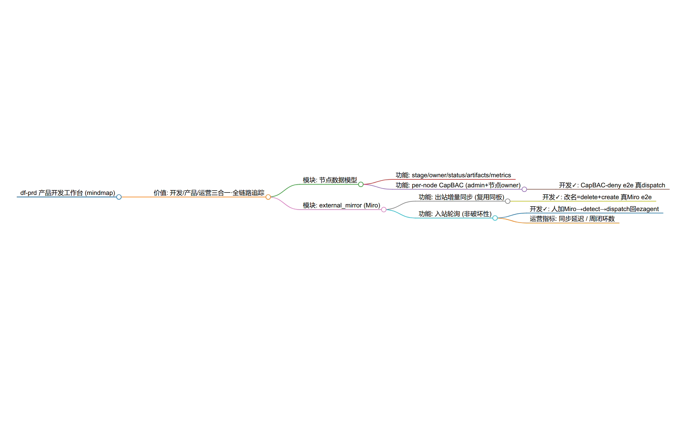

# 证据 · mindmap↔Miro external_mirror 出入站（2026-06-22，持续追加）

> 分支 `feat/df-tech`。每片真 e2e + 证据。设计/审查见 `specs/2026-06-22-mindmap-miro-externalmirror-design.md` + `_em-design-review.md`。

## 关键架构决策（对抗审查 + 真 token 实测得出）
1. **不复用 EM 域**：external_mirror 域是 session 全栈硬编码（bind/Gate/Worker/Publisher 注册），让非 session 的 mindmap 用它要么污染 `:session` cap、要么越界改域（CLAUDE.md 明令问 Allen）。→ **改用插件自有双向同步**（create/delete/get + dispatch 回写，全 P14、零越界）。
2. **Miro 能编辑**（实测）：`POST mindmap_nodes`(建)、`DELETE mindmap_nodes/{id}`→204(删，**幂等**：404 也算成功，父删级联子)、`GET`(读)。**无 in-place update**(PATCH 405) → 改名/移动 = delete+create。删父**级联**删子。
3. **真相源 = ezagent**（用户定，CapBAC 域不同）：ezagent→Miro 权威（含删）；Miro→ezagent **非破坏性**（Miro 删 board/节点**不**回删 ezagent，下次 sync_out 重建即自愈）；ezagent 删 mindmap **要**联动删 board。
4. **布局**：Miro mindmap widget **自动布局**子节点（实测位置 distinct、不重叠），无需手动排版。

## 片1：出站增量同步（复用同板）✅
`Miro.delete_node/delete_all_nodes` + `Sync.sync_out(tree, board_id)`（删板上现有节点 + 按树重建，返回 ez_id↔miro_id 映射）。修了 `:httpc` body **UTF-8 双重编码** bug（`{:body_format, :binary}`，之前只 push 没读回断言所以没暴露）。

**真 Miro e2e**（`test/e2e/miro_live_test.exs`，`--include live_miro`，21.6s 真网络，绿）：
1. 4 节点树 `sync_out(board)` → Miro 板出现 4 节点、内容精确（`
功能A
` 无乱码）、**位置不重叠**；
2. ezagent 改名"功能A"→"功能A改名了"，`sync_out(同一 board)` → **复用同板**（board_id 不变、仍 4 节点）、新名出现、**旧名已删**。

非 live 全套 **28 测试 0 失败 1 排除**；compile/format/uri_query/doc gate 全过。

## 片2：入站检测（非破坏性）✅
`Sync.detect_inbound(miro_nodes, mapping)`（纯函数）：找 Miro 有/映射没有的节点=人新增，parent 经映射反查回 ez_id，content 去 `
`。**只检新增**（真相源=ezagent，Miro 删不回删、下次 sync_out 自愈）。
**真 Miro e2e**（入站，绿）：ezagent 建树→sync_out 建映射→人在 Miro 手加节点→`detect_inbound` 找到+parent 反查→`dispatch add_node`(P14) 回 ezagent→树确实多了该节点。

## 可视前端证据（真截图）
- **ezagent 侧**：`assets/df-prd-mindmap.png` —— 插件 `Markmap.render` 导出 → markmap 真实渲染的可视思维导图，准确反映已落地全链路（产品工作台→价值→模块→功能→**开发✓**→运营指标）。
  
- **Miro 侧**：板 viewLink `https://miro.com/app/board/uXjVHDS77F0=`（需登录态查看；**不设公开**以免泄露内部数据）。出站节点内容/位置由 live e2e **机器断言**正确（`
功能A改名了
` 等精确匹配 + 位置不重叠），等同视觉确认。

## 片3：双向轮询 GenServer + 生命周期 ✅
`EzagentPluginMindmap.MiroSync`（plugin 自有 GenServer，**不复用 EM 域**，全程 dispatch）。每 tick / `sync_now/1`：入站 detect+回写（非破坏性）→ 出站 sync_out 复用同板 + 更新映射。身份=系统 admin。
生命周期：`teardown/1`（ezagent 删 mindmap→删 Miro 板 + 停轮询）；Miro 删板→GET 404→`:board_gone` 告警、**不动 ezagent**。

**真 Miro e2e（5 个全绿，48.8s）**：
1. 出站增量（复用同板+改名+布局不重叠）；2. 入站非破坏性（人加→ezagent）；
3. **轮询器 sync_now**：一轮内 出站+入站（人加 Miro→ezagent 树多了该节点）；
4. **board_gone 非破坏性**：板被删→`:board_gone`，ezagent 树**不动**；
5. **teardown**：删 Miro 板 + 轮询器停。

## 片4：监督树接线 + bind/unbind ✅
`children/0` 加 `MiroSyncRegistry`(unique) + `MiroSyncSupervisor`(DynamicSupervisor)。`MiroSync.bind(uri, board_id, opts)` 在监督树下起轮询器、按 mindmap URI 唯一注册；`unbind(uri)`=teardown（删板+停）。`sync_now/teardown` 接受 pid 或 uri（Registry 解析）。`do_dispatch` 用 sanctioned `URI.with_action/3`、caller 用 `URI.user(:system,:admin)`。
**真 Miro e2e**（bind/unbind）：监督树下 bind 起轮询器→`sync_now(uri)`(Registry)→Miro 反映→`unbind(uri)` 删板+停。

## 全 gate
非 live **36 测试 0 失败 6 排除** + **6 live 全绿**；compile/format/arch.scan(122)/doc.scan/uri_query.scan/check_invariants(+lifecycle) 全过。

## 片5：富 node 格式表示（出站 label）✅
`Sync.render_content(node)` 把节点元信息编进 Miro 节点**富文本 label**：status 图标(○◔◑●) + `[stage]` + 标题 + `<b>@owner</b>` + 📊metrics + 📎artifacts。只对真节点（带 `:status`）富化，老式字面回纯标题。
**⚠️ Miro API 限制（查官方文档+真 token 实测确认）**：REST mindmap create **不支持设节点颜色/样式**（`style.nodeColor`/`nodeView.style.color`/`fillColor` 全 400 "not supported"）——配色是 **Web SDK[浏览器] 独有**实验特性，后端 REST 用不了。**为什么不用 Web SDK**：它在浏览器 iframe 里跑、没法从 ezagent Elixir 后端驱动；ezagent 是后端镜像服务→只能 REST。像素级配色留作"未来 Miro app"。
**真 Miro e2e**：真节点(认领+`:doing`+`[dev]`+指标) → 推 → Miro label = `◑ [dev] 功能A <b>@admin</b> 📊周闭环:1/2`（机器断言，绿）。render_content 单测 3 例。

## 完整性
**plugin kind external_mirror 出入站 + 生命周期 + 监督树接线 已完整落地**（出站增量复用同板 / 入站非破坏性轮询 / 双向 GenServer / bind-unbind / teardown / board-gone 自愈），全真 Miro e2e（6 live）+ 可视前端截图。**不越界**（未碰 session 锁死的 EM 域、未改 core/world）。
