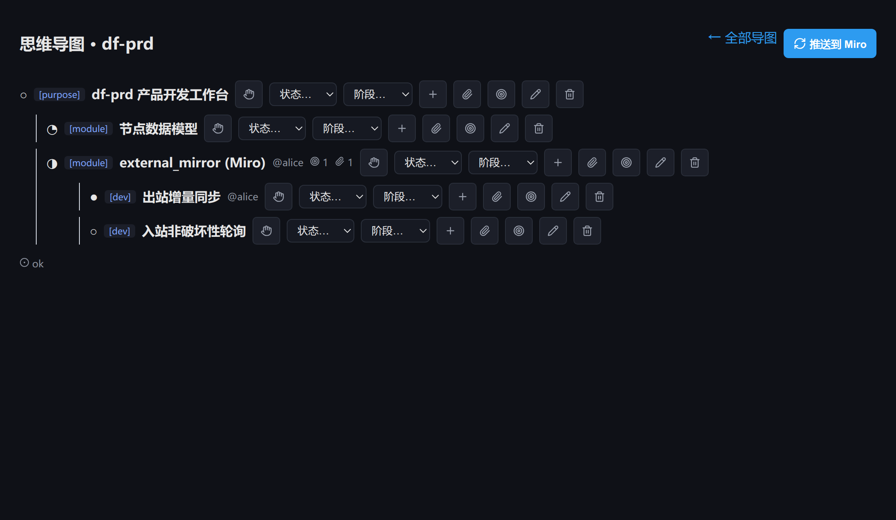

# 证据 · mindmap world 操作面（2026-06-23）

> 分支 `feat/df-tech`。**碰 world**（已按 `docs/guide/world-coordination.md` §5 登记）。
> 新增 surface（加法、近零冲突）：不碰 styles.css / primitives / 他人 surface。

## 做了什么
之前 `/plugins/auto/mindmap` 只读（通用 auto_derive 把 slice 打成 JSON）。本片建**专属操作面** `/plugins/mindmap`，让用户在浏览器里**建树/认领/改状态/改阶段/挂产物/设指标/一键推 Miro**——不再靠 IEx。

### 文件（按 world 标准 surface 模式）
- **前端** `assets/src/components/Mindmap.tsx`：列表页（建/列实例）+ 详情页（递归树 + 富节点信息 + 全套操作控件）。`main.tsx` 加 import + render 分支（复用 `onWorkspacePluginAction` 透传 `pushEvent("world:dispatch")`）。
- **后端读** `lib/ezagent/world/mindmap_data.ex`：`read_tree`（dispatch `:get_tree`，**带登录者身份/caps**）整成 JSON-safe 富树；`list_instances`。
- **后端写** `lib/ezagent/world/mindmap_actions.ex`：12 个 `mindmap.*` 动作 → `Invocation.dispatch`（P14，**ctx 带 `current_entity_uri`/`current_caps`** → per-node CapBAC 在 Behavior 内如实判，world 层不放水）→ re-read 树 → `push_event("world:state")`。`mindmap.sync_miro` 调 `MiroSync.sync_or_bind`（首次建板+绑定、之后复用，返回 board viewLink）。`mindmap.create` 在 plugin InstanceSupervisor 下 spawn。
- **world_live.ex**（共享文件，最小编辑）：route 子句（`/plugins/mindmap[/<uri>]`）+ `state_for_route(%{component: "mindmap"})` 子句 + `@mindmap_actions` 白名单 + dispatch 子句。
- **plugin** `application.ex`：`config_surface` path → `/plugins/mindmap`。

## e2e + 证据
- **前端**：`vite build` 1779 模块 0 错；`tsc --noEmit` 我的 Mindmap.tsx/main.tsx **零类型错**（仅预存 tsconfig 弃用警告）。
- **后端**：`mindmap_data_test.exs` 3 测试绿——真 spawn mindmap + dispatch 建树/认领/状态 → `read_tree` 产出 JSON-safe 富树（`stage`/`status` atom→string、`owner` 带上、artifacts/metrics 列表）；`list_instances` 含实例；`state_for` 列表页给 stages/statuses。
- **可视前端截图**：`assets/world-mindmap-surface.png` —— 组件级渲染（esbuild 打包 Mindmap.tsx + mock 树 → 无头 chrome）。显示树形层级 + 状态图标(○◔◑●) + `[stage]` 徽标 + `@owner` + 指标/产物计数 + 全套操作控件（认领/状态/阶段/加子/挂产物/设指标/改名/删除）+ "推送到 Miro"。
  

## world-coordination 合规（§6 清单）
- [x] 链接指南；§5 登记 owner=Sy(df-tech-yao) + 拥有文件。
- [x] **新增 surface**（非改他人）；不碰 styles.css（组件自带 inline + 复用既有 world-* 类）/primitives。
- [x] world_live.ex 仅加 route/state/白名单子句（最小、加法）。
- [x] 动作 `mode: :call` 同步取结果；权限带登录者 caps、Behavior 内判。
